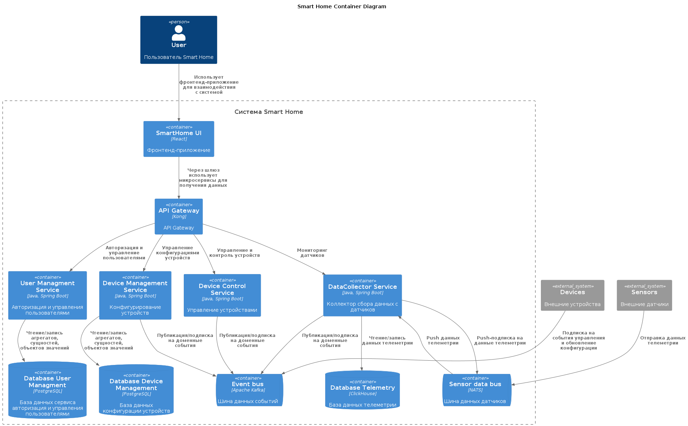

# Задание 1. Анализ и проектирование.

## Описание функциональности текущего монолитного приложения.
- Мониторинг температуры:
    - Получение данных о температуре с датчиков, установленных в домах.
    - Возможность просмотра текущей температуры через веб-интерфейс.
- Управление отоплением:
    - Пользователи могут удалённо включать/выключать отопление в своих домах.

## Анализ архитектуры монолитного приложения (язык программирования, база данных, архитектура, взаимодействие, масштабируемость, развертывание).
- Язык программирования: Приложение написано на Java (фреймворк Spring Boot, ).
- База данных: Используется реляционная база данных PostgreSQL.
- Архитектура: Монолитное приложение, в котором все компоненты (бизнес-логика, обработка запросов, взаимодействие с базой данных) находятся в одном коде.
- Взаимодействие: Синхронное, запросы обрабатываются последовательно.
- Масштабируемость: Ограничена, так как монолитные приложения сложно масштабировать по частям. В случае увеличения нагрузки требуется масштабировать весь монолит целиком.
- Развертывание: Требует остановки всего приложения при внесении изменений или обновления.
- Архитектура ПО: чистая архитектура т.к. зависимости разделены интерфейсами и есть базовые уровни, на уровне ядра(Core) созданы сущности (HeatingSystem, TemperatureSensor), на уровне приложения (Application) создан DTO (HeatingSystemDTO) и сервис (HeatingSystemService), на уровне инфраструктуры располагается репозиторий (repository) и контроллеры API.

## Домены и границы контекстов.
Можно выделить два домена:
1. Домен телеметрии.
2. Домен управления устройствами.

## Визуализация контекста системы AS-IS/TO-BE

# Задание 2. Проектирование микросервисной архитектуры.

## Декомпозиция приложения на микросервисы.
1. **User Managment Service (отдельный микросервис)**
    - **Функции**:
        - Регистрация и авторизация пользователей.
        - Управление учётными записями, ролями и правами доступа.

2. **Device Management Service (отдельный микросервис)**
    - **Функции**:
        - Регистрация новых устройств в системе.
        - Конфигурация устройств (время работы устройства, режимы и т.д.).
        - Конфигурация управления устройством (добавление датчиков к устройству, на основе телеметрии и триггеров формирование команд устройству).
        - Передача устройству валидной конфигурации (после обрыва связи, или недоступности устройства).
    - **Взаимодействие**:
        - Публикация конфигураций устройства `config-device`.
        - Публикация конфигураций управления устройством `config-control-device`.
        - Подписка на топик Kafka `config-request` (запросы на обновление конфигурации устройства).
        - Подписка на топик Kafka `config-control-request` (запросы на обновление конфигурации управления устройством).

3. **Device Control Service (отдельный микросервис)**
    - **Функции**:
        - Управление состоянием устройств (включение/выключение, обновление прошивки, настройка параметров).
        - Просмотр состояния устройств (в том числе данные датчиков).
        - Исполнение логики управления устройствами (на основе телеметрии, триггеров, времени и т.д.)
    - **Взаимодействие**:
        - Публикация команд в топик Kafka `commands-for-devices`.
        - Публикация команд в топик Kafka `config-control-request`.
        - Подписка на топик Kafka `config-control-device`.
        - Подписка на топик Kafka `telemetry-data`.

4. **Data Collector (отдельный микросервис)**
    - **Функции**:
        - Получение сообщений (телеметрии) от датчиков через различные протоколы (например, MQTT, XML, HTTP).
    - **Взаимодействие**:
        - Публикация данных телеметрии в топик Kafka `telemetry-data`.

## Взаимодействие между микросервисами.

1. Взаимодействие пользователя с микросервисами «User Managment Service», «Device Management Service», «Device Control Service» и «Data Collector Service» осуществляется через API Gateway.
2. Микросервис «User Managment Service» позволяет производить авторизированный вход пользователя в систему, выдачи ролей и токена.
3. Микросервис «Device Management Service» посылает конфигурации для устройств через топики kafka. Данный микросервис сохраняет состояние в свою БД.
4. Микросервис «Device Control Service» принимает конфигурацию от сервиса «Device Management Service», подписывается на данные датчиков в сервис «Data Collector». По триггерам (от пользователей, алгоритмам) посылает команды для устройств через топик kafka. Данный микросервис сохраняет состояние в свою БД.
5. Взаимодействие микросервиса «Data Collector» с датчиками происходит через событийную модель посредством обмена сообщениями через mqtt. Данные датчиков публикуется в топик kafka. Так же с сервиса загружаются исторические данные для мониторинга.

## Визуализация архитектуры

### Уровень контейнеров (Containers).

### Уровень компонентов (Components).

### Уровень кода (Code).

# Задание 3. Разработка ER-диаграммы.

